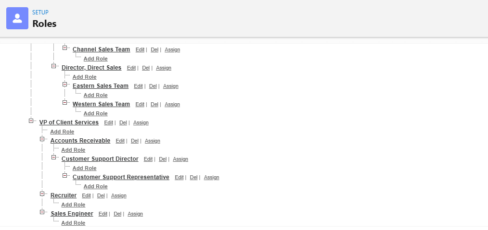
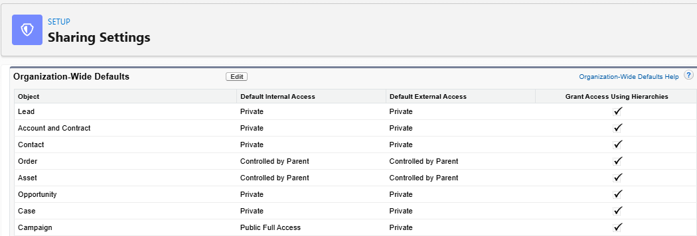
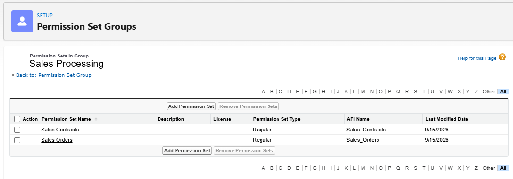
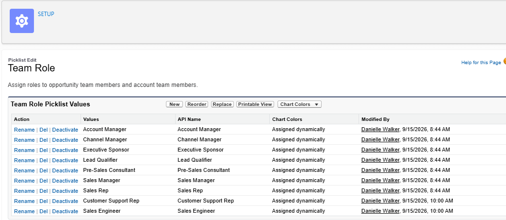
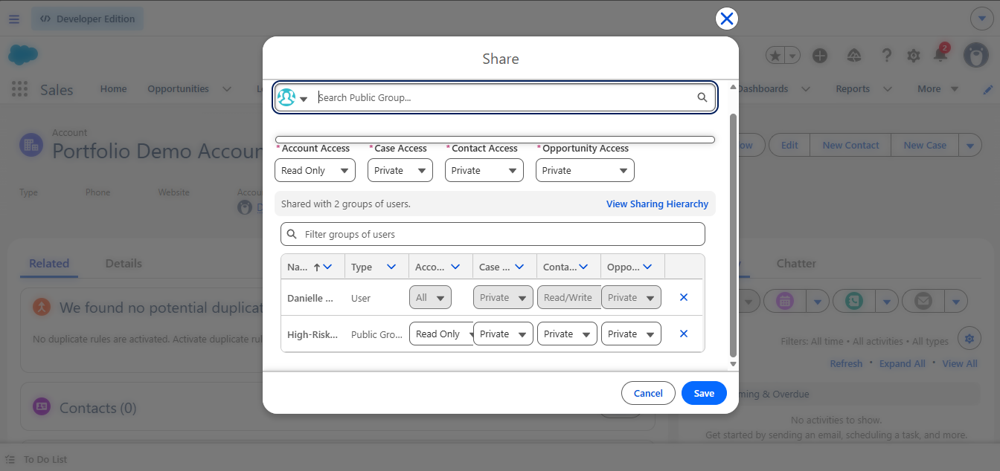

# salesforce-security-access-project
Salesforce Administrator project demonstrating user access, roles, permissions, sharing rules, and record-level security.

# Salesforce Security & Access Management Project

## Project Overview

This project demonstrates my hands-on experience configuring Salesforce security and user access as part of my Salesforce Administrator training.

The goal of the project was to create a secure Salesforce environment that provides users with the appropriate level of access based on their job responsibilities.

## Skills Demonstrated

* Organization-Wide Defaults (OWD)
* Role Hierarchy
* Profiles
* Permission Sets
* Permission Set Groups
* Sharing Rules
* Manual Sharing
* Account Teams
* User Access Management
* Record-Level Security
* Object-Level Security
* Salesforce Setup and Administration

## Business Scenario

The organization required different departments to have access to Salesforce records based on their responsibilities.

The security model needed to protect sensitive information while allowing users to access records necessary to perform their jobs.

## Security Configuration

### Organization-Wide Defaults

Organization-Wide Defaults were configured to establish the baseline level of record access.

### Role Hierarchy

A role hierarchy was created to provide appropriate upward visibility based on organizational structure.

Example roles included:

* CEO
* VP of Services
* Accounts Receivable
* Customer Support Director
* Customer Support Representative
* Sales Engineer
* Recruiter

### Permission Sets

Permission sets were used to provide additional permissions without modifying users' primary profiles.

Examples included:

* Sales Orders
* Sales Contracts

A Permission Set Group named `Sales_Processing` was also configured.

### Sharing Rules

Sharing rules were used to extend record access beyond the organization's default settings.

Examples included:

* Won Opportunities shared with Accounts Receivable
* Cases where `High Risk Compliance = True` are shared with the High-Risk Compliance Team with Read/Write access.

### Manual Sharing

Manual sharing was used when an individual record needed to be shared with a specific user.

### Account Teams

Account Teams were enabled to allow multiple users with different responsibilities to collaborate on customer accounts.

## Key Security Principle

Permissions determine what a user can do.

Sharing determines which records the user can access.

Organization-Wide Defaults establish the baseline, while role hierarchy, sharing rules, teams, and manual sharing can extend record access.

## Tools

* Salesforce Lightning Experience
* Salesforce Setup
* Trailhead
* Salesforce Administrator Training Environment

## Project Status

Completed as part of hands-on Salesforce Administrator training and certification preparation.

## Future Enhancements

Future updates to this project may include:

* Salesforce Flow automation
* Reports and dashboards
* Lightning App Builder configurations
* Data management projects
* Additional security scenarios

## Project Screenshots

### Role Hierarchy

### Organization-Wide Defaults

### Permission Set Group

### Opportunity Sharing Rule

### Case Sharing Rule

### Account Teams

### Manual Sharing

## Author

Danielle Walker

Salesforce Administrator | CRM Support | Business Systems | Technical Support

